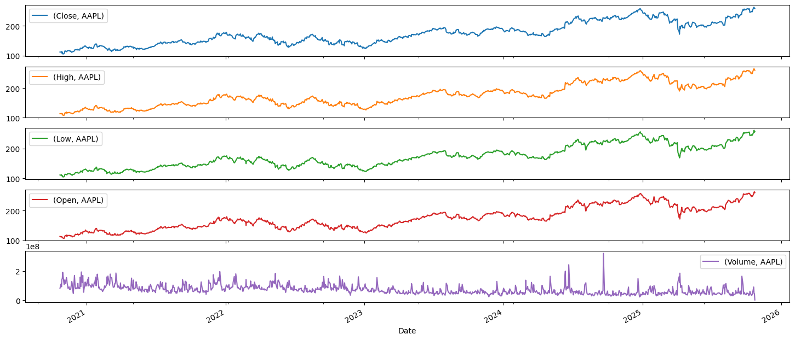
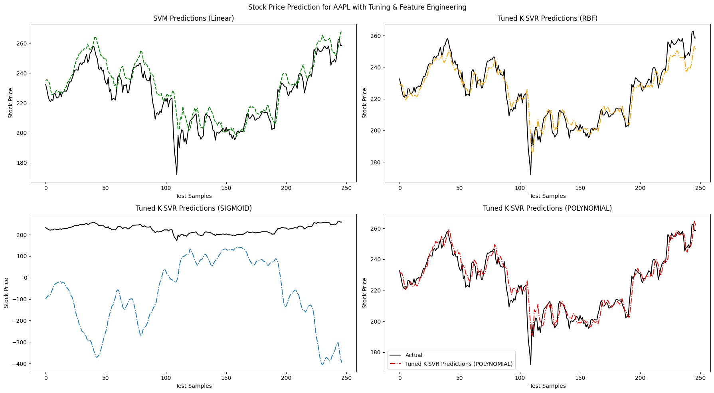
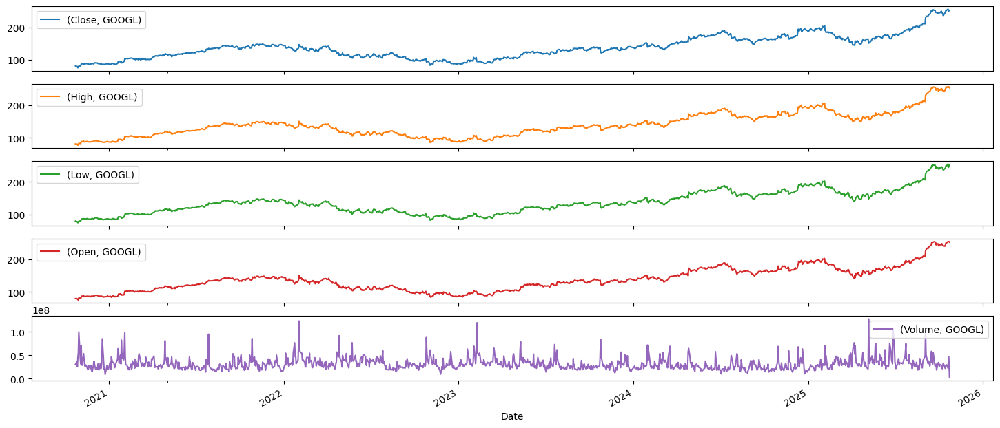
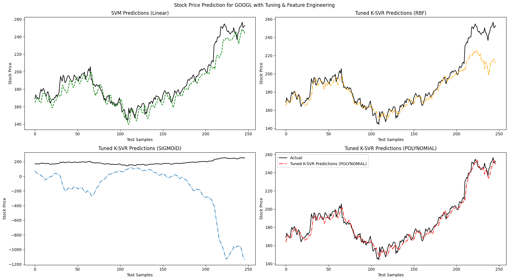

# Stock-Market-Prediction-using-SVM-and-k-SVR
This project aims to create a stock market prediction system using SVM and k-SVR then compare their performance metrics for various stocks from the yahoo finance.
## Dependencies
- numpy
- pandas
- scikit-learn
- matplotlib
- yfinance 

## Running Instructions
- **For Colab:** 
    - Upload the notebook on the google colab.  
    - On colab you don't need to worry about installing any dependencies. You can change the stock ticker as instructed in the notebook
    - Just run cell by cell using `Shift` + `enter`
    - There would be the results coming after each cell are run

- **To run natively:**
    - ```bash
        pip install numpy pandas scikit-learn matplotlib yfinance
    - Now just run the notebook using any of the editor or environment

## File meanings
- readme.txt: having the instructions and information of the project
- .pkl files: saved models for inferencing easily
- M25MAC001_M25MAC002_M25CSE006_ML_Project.ipynb: main code of the project
- Group10_Report.pdf- the project report
- README.md- this file (markdown) for representation purpose

## Dataset Examples
- ### Apple Data
    - Dataset plot

    - Plot of Model prediction and real data

- ### Google Data
    - Dataset Plot

    - Plot of Model prediction and real data



